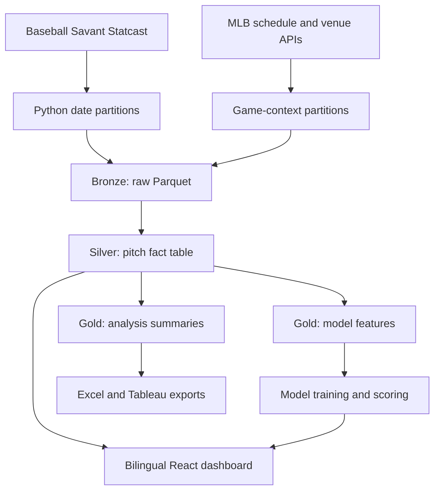
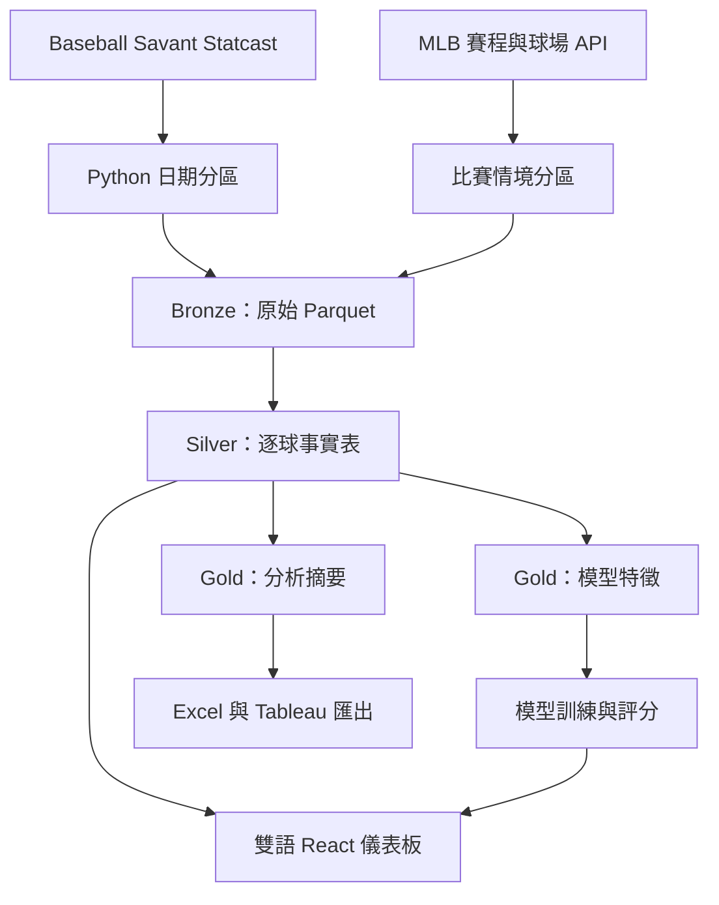

# MLB Pitch Strategy & Plate Discipline Analytics

[English](#english) · [繁體中文](#繁體中文)

**[Live dashboard / 線上儀表板](https://chuanris.github.io/mlb-pitch-analytics/)** · [Deployment / 部署狀態](https://github.com/Chuanris/mlb-pitch-analytics/actions/workflows/deploy-pages.yml) · [Operations / 維護指南](docs/OPERATIONS.md)

> A reproducible MLB Statcast analytics portfolio: Python + DuckDB + SQL + scikit-learn + React.
>
> 可重現的 MLB Statcast 分析作品集：Python + DuckDB + SQL + scikit-learn + React。

---

## English

### Overview

This project examines how MLB pitchers change pitch selection, location, and outcomes across count states and batter handedness. It provides descriptive analysis, post-release pitch-quality models, fantasy-pitching research tools, and a bilingual interactive dashboard.

It is **not** a game-winner prediction system, betting model, or guaranteed fantasy recommendation.

### Highlights

- Restartable Statcast extraction through `pybaseball`
- MLB schedule, venue, roof, and recorded-weather context
- Date-partitioned Parquet files and DuckDB bronze/silver/gold layers
- SQL joins, CTEs, window functions, conditional aggregation, and quality gates
- Leakage-controlled, out-of-time whiff and hard-hit probability models
- Fantasy Pitching Radar and seven-day Stream Planner
- Tableau-ready CSV exports and an Excel lesson workbook
- Reproducible Jupyter tutorials and model audits
- Self-contained React dashboard with English / Traditional Chinese UI
- Source lineage, definitions, denominators, and sample limits shown in the dashboard

### Architecture



The pitch fact table has one row per pitch, keyed by `game_pk + at_bat_number + pitch_number`.

### Quick start

Requirements: Python 3.11+ for the pipeline; Node.js 22.12+ and npm for the dashboard (GitHub Pages uses Node 22).

To explore the committed full-data snapshot without downloading Statcast or training models, run from the repository root:

```powershell
Set-Location dashboard
npm.cmd ci
npm.cmd run dev -- --host 127.0.0.1
```

Open the localhost URL printed by Vite. Choose **Compare**, then select two or three pitchers; use **繁中** to switch language. The tabs are Fantasy, Compare, Models, and Pitch Lab. The public site is a static snapshot: its visible data cutoff can differ from today's date.

To regenerate a small dataset instead, start from the repository root:

```powershell
# 1. Create the Python environment
python -m venv .venv
.\.venv\Scripts\python.exe -m pip install -r requirements.txt

# 2. Run the small real-data pipeline (April 1–3, 2025)
.\.venv\Scripts\python.exe run_pipeline.py --mode sample

# 3. Build the dashboard
Set-Location dashboard
npm.cmd ci
npm.cmd run build
```

Open `dashboard/dist/index.html` after the build completes. On macOS/Linux, activate the environment with `source .venv/bin/activate`, use `python` in place of `.\.venv\Scripts\python.exe`, and use `npm` in place of `npm.cmd`.

The extractor validates existing Parquet partitions before reusing them. Sample mode reads only its configured dates, so a prior full-season run cannot silently alter the lesson dataset.

Sample mode replaces the dashboard snapshot with the small teaching dataset and omits full-mode models and forecasts. Keep the full snapshot when only fixing the UI; do not run the sample pipeline as a prerequisite for viewing the current Compare data.

### Full pipeline

```powershell
.\.venv\Scripts\python.exe run_pipeline.py --mode full
Set-Location dashboard
npm.cmd run build
```

Full mode processes the configured 2025 regular season and the 2026 season through the latest complete day. It refreshes recent partitions, rebuilds DuckDB and exports, retrains the two models, scores the chronological holdout, and refreshes the fantasy tools and dashboard snapshot.

The complete run is substantially slower and downloads much more data than sample mode.

### Preview and rerun safely

Run these commands from the repository root. `--dry-run` checks that the configuration is readable and contains the selected mode, then prints the ordered commands without running them; it does not validate dependencies or cached data.

```powershell
.\.venv\Scripts\python.exe run_pipeline.py --mode full --dry-run
.\.venv\Scripts\python.exe run_pipeline.py --mode sample --skip-extract
.\.venv\Scripts\python.exe run_pipeline.py --config config/pipeline_config.json --dry-run
```

`--skip-extract` rebuilds outputs from existing partitions and requires cached data. It cannot be combined with `--force-extract` or `--refresh-days`. Refresh days must be nonnegative; zero disables recent-partition refresh. A failed step stops the workflow with a nonzero exit code and names the failed module.

### Models and interpretation

The whiff model estimates `P(whiff | swing)` after a pitch has been tracked. The hard-hit model estimates hard-hit probability for eligible batted balls. They may use velocity, movement, release, and location from the current pitch, so neither model is a pre-pitch forecast.

Training and evaluation are time ordered: the earlier season is used for training, followed by chronological validation and untouched test periods. Rolling player form, pitch-type history, and matchup history use prior events only and are frozen before each game.

Generated model artifacts are written under `outputs/models/` and `outputs/predictions/`. These folders are intentionally excluded from Git; regenerate them locally to obtain current results.

### Fantasy research tools

The dashboard includes:

- **Fantasy Pitching Radar:** 7-, 14-, and 30-day windows with Roto balance, strikeout-upside, and ratio-protection profiles.
- **Upcoming Stream Planner:** confirmed probable starters combined with pitcher skill, opponent tendencies, park context, and a separate weather-risk flag.
- **League Strategy Lab:** a transparent personalized-fit calculation for category or points-style research.
- **Player Pool Manager:** browser-local labels such as Available, My roster, Watchlist, and Unavailable.
- **Compare:** two or three pitchers side by side, with separate recent observed skill and next-start strikeout baselines.

### Pregame starter strikeout baseline

The Compare workspace adds a separate pregame target: strikeouts in a pitcher's next start. Three transparent baselines are evaluated: the training-season league mean, a small-sample-adjusted average of the last five starts, and a workload/opponent variant. Early validation selects the model; later validation calibrates an empirical 80% prediction interval. Fixed test dates remain separate. Selection never switches models based on test results.

Historical starts are inferred from each team's first recorded pitcher in completed regular-season games, including openers and short starts. All features are frozen before the calendar day; historical announced probables, injuries, lineups, and pitch limits are unavailable. This retrospective backtest is conditional on actually starting and does not evaluate historical roster or start/sit decisions.

`src.build_start_forecast` is part of both full workflows. It writes backtest rows, evaluation, upcoming forecasts, and comparison data to `outputs/forecast/`. Timestamped forecasts and their model metadata are exclusively created under `outputs/forecast/archive/`; later updates keep the first pregame prediction for each game/pitcher and reconcile completed starts. A changed starter is not a zero-strikeout result. Canceled/postponed games without a completed result remain pending. Historical backtest predictions are never inserted into this live archive.

These tools do not know roster availability or every league's scoring rules. They support research; they do not promise fantasy outcomes.

### Daily update on Windows

Install the optional Windows Task Scheduler job:

```powershell
powershell.exe -NoProfile -ExecutionPolicy Bypass -File .\scripts\install_daily_update_task.ps1
```

Run the same workflow manually:

```powershell
powershell.exe -NoProfile -ExecutionPolicy Bypass -File .\scripts\run_daily_update.ps1
```

The task is named `MLB-Pitch-Analytics-Daily-Update` and is configured for 06:30 local time. Local status and transcript files are written under `logs/`, which is excluded from Git.

The daily script now defaults to `--workflow daily`: it verifies a frozen model release before downloading or rebuilding data, keeps model files and benchmark predictions unchanged, and refreshes recent scores and dashboard outputs. Run one full retraining workflow first to create a release. Use `-Retrain` on the PowerShell script when explicitly retraining.

```powershell
# Daily update using the verified model release
.\.venv\Scripts\python.exe run_pipeline.py --mode full --workflow daily

# Rebuild from cached inputs without retraining
.\.venv\Scripts\python.exe run_pipeline.py --mode full --workflow daily --skip-extract

# Explicit retraining, benchmark scoring, and model release
.\.venv\Scripts\python.exe run_pipeline.py --mode full --workflow retrain
```

`outputs/pipeline_status.json` records workflow, completed-step durations, and the failed step if execution stops. `outputs/lineage/model_release.json` binds the verified model files and frozen benchmark outputs to their original training dataset. Config or feature-contract changes, missing files, modified model files, or data rewinds reject reuse; they never trigger a silent automatic retraining run.

### Validation

```powershell
# Python tests
.\.venv\Scripts\python.exe -m unittest discover -s tests -p "test_*.py" -v

# Dashboard integrity and production build
Set-Location dashboard
npm.cmd run verify:runtime
npm.cmd run build
```

From the repository root, run the focused analysis tests and the actual Compare interaction check (requires Google Chrome; set `CHROME_PATH` for a nonstandard installation):

```powershell
node --test dashboard/tests/mlb-pitch-analysis.test.mjs
node scripts/check_compare.mjs local-check
.\.venv\Scripts\python.exe -m src.health_check --max-age-days 2
```

The browser check opens the built HTML in an isolated profile, clicks Compare, verifies three selectors and intact navigation, rejects browser exceptions and page overflow, and saves desktop/mobile evidence under `outputs/performance/`. Health checks inspect local data and lineage, not the compiled HTML or public site. See the [maintenance guide](docs/OPERATIONS.md) for publishing and troubleshooting.

### Project structure

```text
config/                Pipeline dates, modes, and local paths
data/                  Generated raw/context/Tableau data (Git-ignored)
database/              Generated DuckDB database (Git-ignored)
dashboard/             React source, reviewed snapshot, and build tooling
notebooks/             Tutorial and model-evaluation notebooks
outputs/               Generated models, predictions, reports, and workbook
scripts/               Dashboard build, sanitization, and Windows automation
sql/                   Silver, gold, and analysis SQL
src/                   Extraction, transformation, validation, and export code
tests/                 Python unit and data-quality tests
```

### Metric definitions

- `Whiff Rate = whiffs / swings`
- `Chase Rate = out-of-zone swings / out-of-zone pitches`
- `Hard-Hit Rate = batted balls at 95+ mph / batted balls with measured exit velocity`
- `Zone Rate = pitches in Statcast zones 1–9 / all pitches`

Always inspect the denominator and sample threshold before comparing pitchers.

### Data and security

No API key is required for the documented pipeline. Do not commit `.env` files, credentials, raw data, generated databases, model artifacts, exports, logs, or browser profiles. See [SECURITY.md](SECURITY.md) for the publication checklist.

Primary sources:

- [Baseball Savant CSV documentation](https://baseballsavant.mlb.com/csv-docs)
- [Baseball Savant Statcast search](https://baseballsavant.mlb.com/statcast_search)
- [MLB Stats API schedule](https://statsapi.mlb.com/api/v1/schedule)
- [MLB Stats API venues](https://statsapi.mlb.com/api/v1/venues)
- [pybaseball Statcast documentation](https://github.com/jldbc/pybaseball/blob/master/docs/statcast.md)

---

## 繁體中文

### 專案簡介

本專案分析 MLB 投手在不同球數狀態與打者慣用手下，如何改變球種選擇、進壘位置與結果。內容涵蓋描述性分析、出手後球質模型、Fantasy 投手研究工具，以及可切換英文／繁體中文的互動式儀表板。

本專案**不是**比賽勝負預測、運彩模型，也不保證 Fantasy 決策結果。

### 專案亮點

- 透過 `pybaseball` 取得可中斷續跑的 Statcast 資料
- 整合 MLB 賽程、球場、屋頂狀態與紀錄天氣
- 使用日期分區 Parquet 與 DuckDB bronze／silver／gold 資料層
- 展示 SQL JOIN、CTE、視窗函數、條件彙總與資料品質閘門
- 避免資料洩漏的跨時間揮空率與強擊球機率模型
- Fantasy Pitching Radar 與未來七天 Stream Planner
- Tableau 用 CSV 匯出與 Excel 教學活頁簿
- 可重現的 Jupyter 教學與模型稽核 Notebook
- 英文／繁體中文 React 儀表板，並可產生單一 HTML 檔案
- 儀表板中公開資料來源、指標定義、分母與樣本限制

### 系統架構



逐球事實表每一列代表一球，主鍵為 `game_pk + at_bat_number + pitch_number`。

### 快速開始

需求：資料流程使用 Python 3.11+；儀表板使用 Node.js 22.12+ 與 npm（GitHub Pages 使用 Node 22）。

若只想查看儲存庫內的完整資料快照，不必下載 Statcast 或重新訓練模型。從專案根目錄執行：

```powershell
Set-Location dashboard
npm.cmd ci
npm.cmd run dev -- --host 127.0.0.1
```

開啟 Vite 印出的 localhost 網址，選擇 **Compare**，再選兩至三位投手；點 **繁中** 切換語言。四個分頁為 Fantasy、Compare、Models、Pitch Lab。公開網站是靜態快照，畫面上的資料截止日可能與今天不同。

若要重新產生小型教學資料，請回到專案根目錄執行：

```powershell
# 1. 建立 Python 環境
python -m venv .venv
.\.venv\Scripts\python.exe -m pip install -r requirements.txt

# 2. 執行小型真實資料流程（2025 年 4 月 1–3 日）
.\.venv\Scripts\python.exe run_pipeline.py --mode sample

# 3. 建置儀表板
Set-Location dashboard
npm.cmd ci
npm.cmd run build
```

建置完成後開啟 `dashboard/dist/index.html`。macOS/Linux 請以 `source .venv/bin/activate` 啟用環境，以 `python` 取代 `.\.venv\Scripts\python.exe`，並以 `npm` 取代 `npm.cmd`。

擷取程式會先驗證既有 Parquet 分區再重複使用。Sample 模式只讀取設定中的日期，因此先前的完整球季資料不會悄悄改變教學樣本。

Sample 模式會將儀表板快照替換為小型教學資料，且不包含完整模式的模型與預測。只修介面時保留完整快照；查看目前 Compare 資料不需要先執行 Sample。

### 完整資料流程

```powershell
.\.venv\Scripts\python.exe run_pipeline.py --mode full
Set-Location dashboard
npm.cmd run build
```

Full 模式會處理設定中的 2025 年例行賽，以及 2026 年截至最近完整日期的資料；同時重新整理近期分區、DuckDB、匯出檔、兩個模型、時間序列測試集評分、Fantasy 工具與儀表板快照。

完整模式下載量與執行時間都遠高於 Sample 模式。

### 預覽與重新執行

以下指令請從專案根目錄執行。`--dry-run` 檢查設定檔可讀且包含所選模式，再列出步驟，不下載資料或寫入產物；不會驗證套件或快取資料是否完整。

```powershell
.\.venv\Scripts\python.exe run_pipeline.py --mode full --dry-run
.\.venv\Scripts\python.exe run_pipeline.py --mode sample --skip-extract
.\.venv\Scripts\python.exe run_pipeline.py --config config/pipeline_config.json --dry-run
```

`--skip-extract` 使用既有分區重建產物，需要事先取得資料，且不可搭配 `--force-extract` 或 `--refresh-days`。更新天數不可為負值；零代表停用近期分區更新。步驟失敗時，流程會停止、指出失敗模組並回傳非零結束碼。

### 模型與解讀方式

揮空模型估計球被追蹤後的 `P(whiff | swing)`；強擊球模型則估計合格擊球事件成為強擊球的機率。模型可能使用該球的球速、位移、出手特徵與進壘位置，因此不能描述為投球前預測。

訓練與評估依時間排序：較早球季作為訓練資料，之後依序切分驗證集與未接觸測試集。球員近期狀態、球種歷史與對戰歷史只使用過去事件，並在每場比賽開始前凍結。

模型產物會寫入 `outputs/models/` 與 `outputs/predictions/`。這些資料夾刻意不提交到 Git；若要取得最新結果，請在本機重新產生。

### Fantasy 研究工具

儀表板包含：

- **Fantasy Pitching Radar：**提供 7、14、30 天視窗，以及 Roto 平衡、三振上限與比率保護模式。
- **Upcoming Stream Planner：**只採用已確認的預定先發，結合投手能力、對手趨勢、球場環境，並另外標示天氣風險。
- **League Strategy Lab：**針對 Categories 或 Points 類型聯盟提供透明的個人化適配分數。
- **Player Pool Manager：**可在瀏覽器本機標記 Available、My roster、Watchlist、Unavailable。
- **投手比較：**並排比較兩至三位投手，分開呈現近期歷史表現與下一場三振預測。

這些工具不知道即時自由球員狀態，也無法涵蓋每個聯盟的計分規則；用途是協助研究，而不是保證結果。

### 賽前先發三振基準預測

比較頁提供聯盟平均、近期先發平均，以及工作量／對手調整三種透明基準。模型只使用比賽日期之前已完成的資料；驗證期前段選模型、後段校準 80% 預測區間，最後才以固定測試期評估。區間代表歷史校準的不確定性，不能保證未來覆蓋率。

歷史回測以實際出賽的首位投手為對象，包含開局投手與短局數先發；沒有重建當時公布的預定先發，也未納入傷勢、打線與用球限制。這是可檢驗的基準模型，尚不是經實際未來賽事驗證的預測服務。

每次更新會將賽前預測與 UTC 時間寫入 `outputs/forecast/archive/`，保留每場／每位投手的首次預測，後續與實際結果對帳。更換先發不算零次三振，尚未完成的比賽保留待確認狀態；歷史回測不會冒充即時預測紀錄。模型方法與資料版本見 `outputs/forecast/model_manifest.json`，回測及評估見同目錄的 CSV。

### Windows 每日更新

安裝選用的 Windows 工作排程：

```powershell
powershell.exe -NoProfile -ExecutionPolicy Bypass -File .\scripts\install_daily_update_task.ps1
```

手動執行相同流程：

```powershell
powershell.exe -NoProfile -ExecutionPolicy Bypass -File .\scripts\run_daily_update.ps1
```

排程名稱為 `MLB-Pitch-Analytics-Daily-Update`，預設每天本機時間 06:30 執行。狀態與逐日紀錄會寫入已被 Git 排除的 `logs/`。

每日腳本預設採用 `--workflow daily`：下載或重建前先驗證已凍結的模型版本，保留模型檔與固定基準預測，只更新近期評分與下游產物。首次使用須先完成一次完整重訓；PowerShell 腳本的 `-Retrain` 可明確要求重訓。

```powershell
# 使用已驗證模型更新
.\.venv\Scripts\python.exe run_pipeline.py --mode full --workflow daily

# 使用既有資料更新，不重新訓練
.\.venv\Scripts\python.exe run_pipeline.py --mode full --workflow daily --skip-extract

# 明確重新訓練、固定基準評分並建立模型版本
.\.venv\Scripts\python.exe run_pipeline.py --mode full --workflow retrain
```

`outputs/pipeline_status.json` 保存流程、步驟耗時與失敗位置；`outputs/lineage/model_release.json` 將模型與固定基準產物綁定原始訓練資料。設定或特徵定義改變、檔案遺失、模型被修改、資料日期倒退時會拒絕重用，不會悄悄自動重訓。

### 驗證方式

```powershell
# Python 測試
.\.venv\Scripts\python.exe -m unittest discover -s tests -p "test_*.py" -v

# 儀表板完整性檢查與正式建置
Set-Location dashboard
npm.cmd run verify:runtime
npm.cmd run build
```

從專案根目錄執行聚合邏輯測試與 Compare 實際互動檢查（需安裝 Google Chrome；非預設位置可設定 `CHROME_PATH`）：

```powershell
node --test dashboard/tests/mlb-pitch-analysis.test.mjs
node scripts/check_compare.mjs local-check
.\.venv\Scripts\python.exe -m src.health_check --max-age-days 2
```

瀏覽器檢查使用獨立設定檔開啟建置後 HTML，點擊 Compare，確認三個選單與導覽仍在、沒有執行例外或頁面橫向溢出，並將桌面／手機證據寫入 `outputs/performance/`。健康檢查只驗證本機資料與血緣，不驗證編譯後 HTML 或公開網站。發布與故障排除請見[維護指南](docs/OPERATIONS.md)。

### 專案結構

```text
config/                資料日期、模式與本機路徑設定
data/                  產生的原始／情境／Tableau 資料（Git 排除）
database/              產生的 DuckDB 資料庫（Git 排除）
dashboard/             React 原始碼、審查快照與建置工具
notebooks/             教學與模型評估 Notebook
outputs/               產生的模型、預測、報告與 Excel 活頁簿
scripts/               儀表板建置、清理與 Windows 自動化
sql/                   Silver、Gold 與分析 SQL
src/                   擷取、轉換、驗證與匯出程式
tests/                 Python 單元測試與資料品質測試
```

### 指標定義

- `揮空率 = 揮空次數 / 揮棒次數`
- `追打率 = 好球帶外揮棒 / 好球帶外投球`
- `強擊球率 = 初速至少 95 mph 的擊球 / 有擊球初速測量的擊球事件`
- `進壘率 = Statcast 1–9 區投球 / 所有投球`

比較投手前，務必檢查指標分母與最低樣本門檻。

### 資料與安全

文件中的流程不需要 API Key。請勿提交 `.env`、帳密、原始資料、資料庫、模型產物、匯出檔、日誌或瀏覽器設定檔。完整公開檢查清單請參閱 [SECURITY.md](SECURITY.md)。

主要資料來源：

- [Baseball Savant CSV 文件](https://baseballsavant.mlb.com/csv-docs)
- [Baseball Savant Statcast Search](https://baseballsavant.mlb.com/statcast_search)
- [MLB Stats API 賽程](https://statsapi.mlb.com/api/v1/schedule)
- [MLB Stats API 球場](https://statsapi.mlb.com/api/v1/venues)
- [pybaseball Statcast 文件](https://github.com/jldbc/pybaseball/blob/master/docs/statcast.md)

---

## Reliability / 資料與產物可靠性

- Missing exit velocity remains an unknown hard-hit label, excluded from model targets and rate denominators. Total and measured counts remain separate; `outputs/measurement_coverage.csv` reports coverage by season.
- Quality gates compare completed regular-season games in the cached MLB schedule against Statcast. They detect missing Statcast games, but cannot detect games absent from both sources.
- `model_evaluation` in `config/pipeline_config.json` fixes training through 2025-09-28, validation from 2026-03-25, and testing from 2026-06-13 through 2026-09-03. Adding dates cannot change benchmark membership. Changing boundaries starts a new benchmark and requires regeneration.
- Each rebuild commits `metadata.dataset_version`. Model, scoring, Fantasy and snapshot CLI stages write SHA-256 receipts to `outputs/lineage/`; downstream stages reject missing, stale, altered or superseded dependencies. These local receipts are not an immutable historical archive or production model registry.
- Sample snapshots omit full-mode model/Fantasy artifacts. Optional `paths.dashboard_snapshot` redirects the snapshot for isolated validation.
- Snapshot replacement is atomic. Other outputs are not one atomic release bundle; a failed stage invalidates its receipt and blocks downstream snapshot generation.

- 強擊球初速缺失保留為未知，不納入模型標籤與比率分母；全部擊球數與有效測量數分開保存，`outputs/measurement_coverage.csv` 列出各球季覆蓋率。
- 品質閘門將快取賽程中已完成的例行賽與 Statcast 比對，可找出缺少逐球資料的比賽，但無法發現兩個來源都沒有的比賽。
- 設定中的 `model_evaluation` 固定訓練截止日為 2025-09-28、驗證開始日為 2026-03-25、測試期為 2026-06-13 至 2026-09-03；新增日期不會改變基準成員，修改邊界則須重建新基準。
- 每次重建保存 `metadata.dataset_version`，模型、評分、Fantasy 與快照產生 SHA-256 血緣收據；下游拒絕缺失、過期、遭修改或已被取代的相依產物。這些本機收據不是不可竄改的歷史封存或正式模型登錄服務。
- Sample 模式不會夾帶舊的完整球季模型結果；可用 `paths.dashboard_snapshot` 將隔離驗證的快照寫至其他位置。
- 快照採原子替換，但全部輸出並非同一原子版本包；步驟失敗會使收據失效，阻止下游產生混用版本的快照。

Frozen benchmark evaluation uses `*_test_predictions.parquet`; Fantasy uses separate `*_recent_predictions.parquet` covering the latest 60 calendar days after validation. These recent scores support current/prior windows and remain post-release pitch-quality estimates, not pregame predictions.

固定基準評估使用 `*_test_predictions.parquet`；Fantasy 使用獨立的 `*_recent_predictions.parquet`，涵蓋最近 60 個日曆日且只取驗證期之後的資料，支援本期與前期比較。這些仍是出手後球質評分，不是賽前預測。

The dashboard keeps its complete offline snapshot. Stable filtered-row references, single-pass totals and cached Pitch Lab aggregations avoid recalculating large charts for unrelated interactions. `node scripts/measure_dashboard.mjs <label>` saves an isolated local Chrome measurement and screenshots under `outputs/performance/`; these are simulated measurements, not real-user Core Web Vitals. That measurement helper currently uses the default Windows Chrome installation.

前端保留完整資料與離線單檔：篩選後資料使用穩定參照，總量以單次掃描計算；只有開啟 Pitch Lab 時才計算大型圖表聚合，切換語言或操作球員清單會沿用快取。可用 `node scripts/measure_dashboard.mjs <label>` 在獨立 Chrome 中量測，結果與桌面／手機截圖保存於 `outputs/performance/`。這是本機模擬測試，並非真實使用者的 Core Web Vitals；此效能量測腳本目前使用 Windows 預設 Chrome 安裝位置。

```powershell
# Rebuild cached data with the existing model release / 以既有模型版本重建快取資料
.\.venv\Scripts\python.exe run_pipeline.py --mode full --workflow daily --skip-extract
Set-Location dashboard
npm.cmd run build
```

## Live forecast monitoring / 實際預測監測

Read-only operational health / 唯讀運作健康檢查：

```powershell
.\.venv\Scripts\python.exe -m src.health_check --max-age-days 2
```

Exit codes: `0` checks passed, `1` needs attention, `2` error. Checks UTC calendar-day data age, recursive snapshot lineage and the last pipeline status without changing files or fetching data. The age threshold is an operational reminder, not proof of missing games; consider the configured range and off-season. A running marker does not prove a live process. This command does not validate the compiled HTML or external deployment.

結束碼：`0` 檢查通過、`1` 需要留意、`2` 錯誤。指令直接讀取目前資料日期、snapshot 遞迴血緣與最後 pipeline 狀態，不修改檔案或下載資料。資料年齡依 UTC 日曆日計算；超過門檻不代表一定缺比賽，應同時考慮設定範圍與休賽期。`running` 紀錄也不代表程序仍存活。靜態 dashboard 不會自動得知後續失敗；此指令不驗證編譯後 HTML 或外部部署。失敗或中斷的 pipeline 現在也會記錄結束時間，方便比對 logs。

`outputs/forecast/live_monitor.csv` summarizes first archived forecasts by model version: scored, pending, excluded and invalid outcomes; MAE, RMSE, signed bias and interval coverage. Only observed finite outcomes enter errors; coverage uses its own valid-bound denominator. Fewer than 30 outcomes is a display caution, not a statistical validation threshold. Backtests are never pooled with live outcomes. The full daily/retrain workflows regenerate this table automatically.

「投手比較」新增實際預測監測，依模型版本分列有效結果、待完成、排除、無效結果、MAE、偏差與區間覆蓋率。正偏差表示高估三振數；沒有結果時保留未知。區間使用獨立的有效樣本分母；30 筆只是顯示提醒門檻，不是可靠性認證。完整模式的每日更新與重新訓練流程均自動更新此表。

## License / 授權

No license has been added. All rights are reserved unless the repository owner states otherwise.

目前尚未加入授權條款；除非專案擁有者另行說明，否則保留所有權利。
