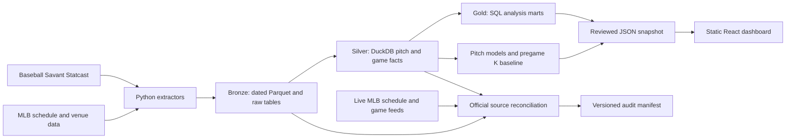

# MLB Pitch Analytics

[](https://github.com/Chuanris/mlb-pitch-analytics/actions/workflows/ci.yml)

An MLB Statcast data platform and interactive research dashboard. The project takes dated pitch and game data through Python extraction, DuckDB and SQL transformations, quality checks, model evaluation, and a static React dashboard. It also includes a PostgreSQL operational store, a dbt project, Airflow orchestration, and a deployable GCS/BigQuery design.

[Live dashboard](https://chuanris.github.io/mlb-pitch-analytics/) · [Engineering evidence](docs/PORTFOLIO.md) · [Operations guide](docs/OPERATIONS.md)

The public dashboard is a published snapshot. Its data cutoff may differ from the local snapshot and from today's date.

## Explore the dashboard

| Workspace | What it helps answer |
| --- | --- |
| **Fantasy** | Which pitchers merit a closer look across recent skill, upcoming starts, and league needs? |
| **Hitters** | Which available hitters fit open lineup dates and specific 5×5 category needs? |
| **Compare** | How do two or three pitchers differ in observed skill and next-start strikeout baselines? |
| **Models** | How did the pitch-quality models perform on a fixed chronological test period? |
| **Pitch Lab** | How do pitch mix, location, count, handedness, and outcomes relate? |

The interface supports English and Traditional Chinese. The hitter player pool is saved in the browser; it is not a live connection to a fantasy league.

## Verified results

These are dated measurements, not claims that every source, deployment, or future run is complete.

| Evidence | Result | Scope |
| --- | --- | --- |
| Reviewed local snapshot, September 23, 2026 | Data through September 22; 1,437,857 Raw rows across all game types, 1,408,305 regular-season Raw rows, 1,403,065 Silver pitch rows, 4,788 games, and 1,128 pitchers | Local DuckDB and reviewed dashboard snapshot; the public site may show an earlier version |
| Pipeline verification, September 21, 2026 | 33/33 SQL quality checks passed; 32/32 model-release files verified; health check passed at run time | Local data and artifact lineage |
| Project checks, September 23, 2026 | 163 Python tests passed, three PostgreSQL integration tests skipped locally; 14 focused MLB dashboard, payload, and snapshot tests passed; production build, protected-runtime verification, and Chrome prepublication smoke passed | Local environment; PostgreSQL service tests have a separate CI job |
| Dashboard payload, September 23, 2026 | Reviewed snapshot reduced from 45,673,684 to 42,985,307 bytes (5.9%); self-contained HTML reduced from 48,743,348 to 46,055,078 bytes (5.5%); deterministic gzip-9 size is 3,498,200 bytes | Same 71,677-row `pitch_summary` grain and calculations; CI enforces source, build, gzip, query-size, and row-count budgets |
| [DuckDB benchmark](docs/SQL_PERFORMANCE.md), September 12, 2026 | Four workloads over **1,355,356** pitch facts; 1/2/4/8-thread results matched by checksum; best measured scan and join median speedups were 1.93× and 1.95× | Warm local DuckDB runs on one machine, before the later data refresh |
| [Data platform CI run](https://github.com/Chuanris/mlb-pitch-analytics/actions/runs/34642844311) | Six jobs passed, including Python, PostgreSQL, dbt, BigQuery target parsing, Terraform validation, and Airflow plan execution | BigQuery and Terraform checks did not run a live GCP deployment |

### MLB source audit: September 9–20, 2026

The official MLB schedule and live game feeds reported **159 final games, 12,110 all plays, 12,087 pitch-bearing plate appearances, and 46,843 actual pitch events** across these 12 dates. The versioned [audit manifest](evidence/mlb-source-audit/2026-09-09_2026-09-20.json) also records 46,843 Raw pitch-proxy rows, with daily Raw counts matching the official event totals on all 12 dates. The proxy is defined explicitly in the manifest and does not provide an independent cross-source event identifier.

The implemented [source reconciler](docs/SOURCE_RECONCILIATION.md) compares the official feeds with **Silver** at game and plate-appearance grain. It passed on seven dates and reported `source_mismatch` on five. Silver had 46,821 pitch rows in the audited window, **22 fewer** than the official actual-pitch count. The missing Silver rows exist in Raw with real pitch descriptions but a null `pitch_type`; the current Silver filter excludes them. Some other null-`pitch_type` rows are automatic ball or strike events rather than actual pitches, so the filter cannot simply be removed.

The audit supports count agreement between the MLB feeds and the documented Raw proxy for those dates. It does not establish event-by-event semantic equivalence, season-wide completeness, upstream correctness or immutability, or an independent audit of MLB. The manifest deliberately remains `error / audit_has_errors` because the five Silver mismatches are evidence to investigate, not results to hide.

## How the system fits together



The Silver pitch fact is keyed by `game_pk + at_bat_number + pitch_number` and contains retained, classified pitches. Its current null-`pitch_type` exclusion is the coverage gap described above. The source-audit branch separately fetches MLB schedule and play-by-play responses, then compares their counts with the documented Raw proxy and local Silver data; it does not run as part of the normal dashboard render.

The main local analytical path uses DuckDB. The [dbt project](docs/DBT.md) reproduces the core Bronze-to-Silver-to-Gold transformation in isolated local schemas and defines a BigQuery target with incremental merge, date partitioning, and clustering. That target and its [Terraform infrastructure](docs/CLOUD.md) have passed credential-free contracts; a real GCP run still needs a project, billing, and an approved deployment.

The optional [PostgreSQL OLTP store](docs/OLTP.md) keeps mutable run, partition, forecast-request, and watchlist state with constraints and transactional writes. The [Airflow 3 DAG](docs/AIRFLOW.md) schedules the pipeline, limits parallel work, serializes shared DuckDB writes, and ends with a health check. CI executes the DAG in plan-only mode; that test does not refresh data or prove a continuously running scheduler.

## Run locally

Use Python 3.11+ for the pipeline and Node.js 22.12+ for the dashboard. Commands below use Windows PowerShell and start from the repository root unless a section says otherwise.

### View the included snapshot

This path needs no Statcast download or model training:

```powershell
Set-Location dashboard
npm.cmd ci
npm.cmd run dev -- --host 127.0.0.1
```

Open the localhost address printed by Vite. Return to the repository root before running the commands below.

### Build a small teaching dataset

The sample covers April 1–3, 2025. It replaces the tracked dashboard snapshot with sample output, so preserve any reviewed full-data snapshot before running it.

```powershell
python -m venv .venv
.\.venv\Scripts\python.exe -m pip install -r requirements.txt
.\.venv\Scripts\python.exe run_pipeline.py --mode sample --dry-run
.\.venv\Scripts\python.exe run_pipeline.py --mode sample
```

`--dry-run` prints the command plan without downloading data or writing outputs. It does not validate cached data or installed dependencies. Existing Parquet partitions are checked before reuse. See [operations](docs/OPERATIONS.md) for cache and failure recovery.

### Refresh the full dataset

Full mode uses the configured 2025 season and the latest complete Los Angeles calendar date in the configured 2026 range. The first full run, or a run after a model feature-contract change, needs retraining:

```powershell
.\.venv\Scripts\python.exe run_pipeline.py --mode full --workflow retrain --dry-run
.\.venv\Scripts\python.exe run_pipeline.py --mode full --workflow retrain
```

Once a model release exists and verifies successfully, a daily run reuses it and refreshes recent scores and downstream outputs:

```powershell
.\.venv\Scripts\python.exe run_pipeline.py --mode full --workflow daily --dry-run
.\.venv\Scripts\python.exe run_pipeline.py --mode full --workflow daily
```

The daily workflow checks the frozen release before extraction. `--skip-extract` rebuilds from cached partitions; it cannot be combined with `--refresh-days` or `--force-extract`. The default full run downloads substantially more data than sample mode. A local refresh does not commit the snapshot or redeploy GitHub Pages.

For the optional Windows schedule, use [install_daily_update_task.ps1](scripts/install_daily_update_task.ps1); [run_daily_update.ps1](scripts/run_daily_update.ps1) runs the same update manually. See the [operations guide](docs/OPERATIONS.md) for setup and publishing steps.

### Check data and rebuild the dashboard

```powershell
# Read-only operational status; data age uses UTC calendar dates.
.\.venv\Scripts\python.exe -m src.health_check --max-age-days 2

# In-memory examples of pass, attention, and integrity-error behavior.
.\.venv\Scripts\python.exe -m src.observability_demo

# Live official MLB comparison for one date; writes a local evidence JSON.
.\.venv\Scripts\python.exe -m src.reconcile_mlb_source --date 2026-09-20 `
  --output outputs/observability/mlb-source-reconciliation-2026-09-20.json

# Rebuild the compact, versioned 12-date source-audit manifest.
.\.venv\Scripts\python.exe -m src.build_mlb_source_audit `
  --start-date 2026-09-09 `
  --end-date 2026-09-20 `
  --output evidence/mlb-source-audit/2026-09-09_2026-09-20.json

Set-Location dashboard
npm.cmd run verify:runtime
npm.cmd run build
```

The single-date reconciler returns `0` for agreement, `1` when official evidence is unavailable or no final games exist, and `2` for a mismatch. The range audit applies the same source contract to every date, adds the documented Raw proxy comparison, and writes its manifest even when it returns nonzero. On the versioned audit, September 20 returns `2` because Silver is short by one pitch. The current [observability policy](docs/OBSERVABILITY.md) treats missing same-date completed-game coverage as an error and pitch-volume anomalies as attention; neither rule alone proves source completeness.

## Validation and engineering evidence

From the repository root:

```powershell
.\.venv\Scripts\python.exe -m unittest discover -s tests -p "test_*.py" -v
node --test dashboard/tests/mlb-pitch-analysis.test.mjs `
  dashboard/tests/mlb-hitter-analysis.test.mjs `
  dashboard/tests/dashboard-payload-budget.test.mjs `
  dashboard/tests/snapshot-integrity.test.mjs
node scripts/check_dashboard_payload.mjs
node scripts/check_compare.mjs prepublish
```

The payload check reads the reviewed snapshot and built HTML, then enforces the limits in `config/dashboard_performance.json`; its gzip figure is a deterministic local compression measurement, not proof of a particular CDN response header. The browser check requires Chrome and a fresh `dashboard/dist/index.html` build. It opens an isolated profile, exercises Compare and Hitters, checks desktop and mobile overflow, and saves local evidence under `outputs/performance/`. The last local `npm test` attempt was not green: generic starter-maintainer tests assert example queries and theme defaults that this MLB app intentionally replaces, and the broad run did not exit cleanly. The scoped checks and Chrome prepublication smoke above passed on the documented snapshot.

| Area | Inspectable evidence | Current boundary |
| --- | --- | --- |
| SQL and parallelism | [Benchmark inputs, plans, checksums, median and p95](docs/SQL_PERFORMANCE.md) | Local DuckDB behavior, not distributed MPP performance |
| Transformation | [dbt models, incremental rerun, and 20 data tests](docs/DBT.md) | DuckDB build verified; BigQuery target parsed and contract-tested |
| OLTP | [PostgreSQL schema and service-backed CI tests](docs/OLTP.md) | Operational companion, not the analytical warehouse |
| Cloud | [GCS, BigQuery, OIDC, and Terraform design](docs/CLOUD.md) | Deployable and validated without a live GCP apply |
| Orchestration | [Airflow DAG and topology contracts](docs/AIRFLOW.md) | CI plan execution, not a live scheduler run |
| Reliability | [Observability rules](docs/OBSERVABILITY.md) and [official source reconciliation](docs/SOURCE_RECONCILIATION.md) | Local checks and dated official comparisons have different claims |
| Engineering process | [AI-assisted workflow and human review evidence](docs/AI_WORKFLOW.md) | No unmeasured productivity claim |

## Interpretation and limits

- The whiff model estimates `P(whiff | swing)` after a tracked pitch. The hard-hit model scores eligible batted balls using measured contact data. Both can use features from the current pitch and must not be presented as pre-pitch forecasts.
- Compare includes a separate **pregame** strikeout baseline. Its fixed chronological test period ends September 3, 2026; later data refreshes do not silently change test membership. Historical backtests are conditional on the pitcher actually starting. Injury, lineup, and pitch-limit information is incomplete.
- A live forecast remains pending until an observed outcome is available. Postponed games and changed starters are not scored as zero strikeouts. See the [forecast monitoring guide](docs/OPERATIONS.md).
- `Whiff rate = whiffs / swings`; `chase rate = out-of-zone swings / out-of-zone pitches`; `hard-hit rate = 95+ mph batted balls / batted balls with measured exit velocity`. Review denominators and sample sizes before comparing players.
- The dashboard supports fantasy research. It does not know every league's roster availability or scoring rules and does not guarantee decisions or outcomes.

## Repository map

| Path | Purpose |
| --- | --- |
| `src/`, `sql/`, `config/` | Extraction, transformations, validation, and pipeline policy |
| `warehouse/`, `oltp/`, `orchestration/` | dbt, PostgreSQL, and Airflow implementations |
| `infra/`, `cloud/`, `benchmarks/` | Cloud infrastructure, verification, and SQL performance evidence |
| `dashboard/` | React application, reviewed JSON snapshot, and build tooling |
| `tests/`, `docs/`, `evidence/` | Regression contracts, detailed engineering evidence, and compact versioned audit manifests |
| `data/`, `database/`, `outputs/`, `logs/` | Generated local data and artifacts; generally excluded from Git |

Primary sources: [Baseball Savant Statcast](https://baseballsavant.mlb.com/statcast_search), [Statcast CSV field documentation](https://baseballsavant.mlb.com/csv-docs), [MLB schedule API](https://statsapi.mlb.com/api/v1/schedule), and [pybaseball documentation](https://github.com/jldbc/pybaseball/blob/master/docs/statcast.md).

Do not commit credentials, raw data, generated databases, model files, logs, or browser profiles. Review [SECURITY.md](SECURITY.md) before publication. No license has been added; all rights are reserved unless the repository owner states otherwise.
