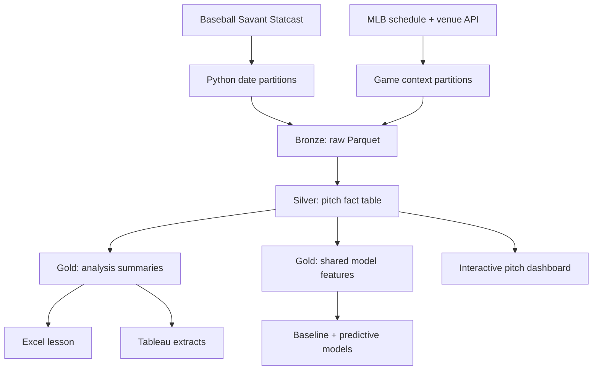

# MLB Pitch Strategy & Plate Discipline Analytics

This portfolio project studies how MLB pitchers change pitch selection, location, and outcomes across count states and batter handedness. It is descriptive and diagnostic: it does **not** predict game winners.

> Repository note: no API key is required for the documented pipeline. Local credentials, browser profiles, generated databases, raw Statcast partitions, model artifacts, and exports are excluded from version control. See [SECURITY.md](SECURITY.md) for the publication checklist.

## What this version demonstrates

- Restartable Python extraction from Baseball Savant through `pybaseball`
- Restartable MLB game-time, venue, roof, and recorded-weather extraction
- Date-partitioned Parquet raw files
- DuckDB bronze, silver, and gold data layers
- SQL joins, CTEs, window functions, conditional aggregation, and data modeling
- Automated data-quality gates
- Excel audit and formula practice
- Tableau-ready exports
- A reproducible Jupyter tutorial
- Leakage-controlled, out-of-time whiff and hard-hit probability models
- A self-contained interactive dashboard with reviewed-data provenance

## Pipeline



The fact table grain is one pitch, identified by `game_pk + at_bat_number + pitch_number`.

## Quick start

Create and activate a virtual environment, then install the dependencies:

```bash
python -m venv .venv
# Windows PowerShell: .venv\Scripts\Activate.ps1
# macOS/Linux: source .venv/bin/activate
pip install -r requirements.txt
```

Run the small real-data lesson pipeline:

```bash
python run_pipeline.py --mode sample
```

This downloads April 1–3, 2025 Statcast data, builds the database, runs quality checks, and refreshes the Excel, Tableau, and dashboard data outputs. Existing raw partitions are skipped, so interrupted runs can be restarted safely.

Open the built dashboard after the pipeline finishes:

```text
dashboard/dist/index.html
```

The dashboard is a self-contained HTML file. Its task-based navigation separates Fantasy decisions, model validation, and pitch exploration, with pitch-level filters shown only where they apply. Use the English / 繁體中文 switch to change the authored interface language; both the language and selected workspace persist in the current browser. Player, team, venue, pitch-type, and model names remain in their canonical source form. The source-data panel records the reviewed DuckDB table, SQL, date range, sample limitation, and metric definitions used by every component.

The pipeline validates an existing Parquet partition before skipping it. The build step reads only the partitions configured for the selected mode, so a previous full-season run cannot silently change the sample lesson dataset.

After the first lesson, run the complete 2025–2026 regular-season pipeline:

```bash
python run_pipeline.py --mode full
```

Full mode loads the complete 2025 regular season and the 2026 season through the latest complete day, capped at the scheduled September 27 finale. It uses restartable weekly partitions, refreshes the latest three days to pick up Statcast corrections, and filters to `game_type = 'R'` in the silver layer.

Full mode also rebuilds the whiff and hard-hit training marts and retrains both
post-release pitch-quality models. Run those steps independently with:

```bash
python -m src.train_whiff_model --config config/pipeline_config.json
python -m src.train_hard_hit_model --config config/pipeline_config.json
python -m src.score_pitch_models --config config/pipeline_config.json
```

The model predicts `P(whiff | swing)` after a pitch has been tracked. It may use
the current pitch's velocity, movement, release characteristics, and location,
so it must not be described as a pre-pitch forecast. Training uses the earlier
season; the latest season is split chronologically into validation and untouched
test periods. Outputs are written to `outputs/models/`:

- `whiff_model_metrics.json`: split dates, feature contract, versions, and metrics
- `whiff_model_calibration.csv`: calibration-bin diagnostics
- `whiff_model_monthly.csv`: observed versus predicted monthly whiff rates
- `whiff_*.joblib`: fitted scikit-learn pipelines
- `whiff_probability_calibrator.joblib`: validation-only Platt calibration layer when its chronological acceptance gate passes

Champion scoring writes full pitch-level holdout predictions plus compact ranking
artifacts to `outputs/predictions/`:

- `whiff_test_predictions.parquet`: calibrated `P(whiff | swing)` for every test swing
- `hard_hit_test_predictions.parquet`: champion hard-hit probability for every test batted ball
- `model_leaderboards.csv`: sample-gated pitcher and pitch-type expected-rate rankings
- `prediction_manifest.json`: scorer, date-window, denominator, and row-count lineage

Fantasy decision-support artifacts are written to `outputs/fantasy/`:

- `pitcher_fantasy_radar.csv`: recent 7-, 14-, and 30-day pitcher rankings
- `fantasy_radar_manifest.json`: profile weights, workload gates, lineage, and limitations
- `matchup_stream_planner.csv`: upcoming schedule, probable starters, opponent context, park context, weather risk, and stream scores
- `matchup_stream_planner_manifest.json`: live-source window, scoring weights, coverage, and limitations

The training marts also contain leakage-safe pregame rolling form. Whiff form
uses the pitcher's prior 200 swings, batter's prior 50 swings, and both players'
prior 30 days. Hard-hit form uses the same windows over prior batted balls. Each
value is frozen at the player's first eligible event of the game, so no current
game result can enter its own features.

Pitch-type form adds the pitcher's prior 100 and batter's prior 30 eligible
events for the current pitch type, plus 30-day pitch-type windows. Matchup form
uses prior events between the same pitcher and batter. These are also frozen
before the game; missing matchup history remains missing rather than being
mistaken for league-average experience.

The pipeline compares base, weather, rolling, 14-day recent form, pitch-type,
matchup, and combined candidates on every run. Through September 1, 2026, the
whiff champion is the tuned, Platt-calibrated rolling + pitch-type + matchup
model (`0.42224` test log loss; `0.7952` ROC-AUC; `0.0108` ECE). The hard-hit
champion is rolling + pitch-type without matchup (`0.59397`; `0.7111`; `0.0048`
ECE). The 14-day candidates were evaluated but did not pass the validation gate,
so they remain research features rather than production scorer inputs.
Matchup alone is nearly neutral for whiff and worsens hard-hit accuracy, while
weather still worsens both tasks, so each target keeps its own validated feature
set instead of sharing one forced production scorer.

The dashboard includes fixed-holdout champion cards, target-specific model-lift
comparisons, calibration curves, a Whiff/Hard-hit scoring explorer, sample-gated
pitcher and pitch-type rankings, and the latest 250 scored events per target.
The full pitch-level scores stay in parquet rather than inflating the standalone
HTML. Page filters intentionally do not alter these model-evaluation and scoring
blocks because they describe the reviewed chronological holdout rather than the
current descriptive pitch slice.

### Fantasy Pitching Radar

The bilingual dashboard includes a Fantasy Pitching Radar for recent pitcher
form. It supports 7-, 14-, and 30-day windows; Roto balance, Strikeout upside,
and Ratio protection profiles; and starter, multi-inning, or relief workload
filters. The 0-100 signal combines calibrated expected whiff rate, expected
hard-hit suppression, K-BB%, chase rate, and walk suppression. Rankings expose
sample size, role inference, underlying rates, prior-window change, and a short
decision label.

An insight-first decision board turns the selected ranking into a compact daily
research queue: skill leader, starter stream, momentum watch, and underlying
upside. Each item shows a conservative evidence-volume label and a next research
action. The underlying-skill gap averages the expected-versus-observed whiff and
hard-hit rate gaps; it is a hypothesis flag for deeper review, not a calibrated
regression forecast.

The Upcoming Stream Planner adds the next seven days of regular-season games
from the MLB Stats API. It never guesses a missing probable starter. Confirmed
probables are joined to the 14-day pitcher skill signal, the opponent's most
recent 30 complete days of strikeout/walk/hard-hit tendencies, and the park's
reviewed 2025-2026 contact environment. The resulting zero-to-100 Stream Score
uses 65% pitcher skill, 25% opponent matchup, and 10% park context. Open-Meteo's
hourly forecast nearest scheduled first pitch supplies a separate weather-risk
flag; weather does not change the Stream Score.

The dashboard's League Strategy Lab preserves that base score and calculates a
separate Personalized Fit. Categories uses the chosen skill profile. Points skill
proxy blends 60% chosen profile with 40% strikeout upside; low and balanced risk
can subtract fixed weather, sample-volume, and cooling-trend haircuts, while high
risk applies none. A fit of 70 starts the research shortlist.

Personalized Fit is still a skills-based comparison, not projected fantasy
points. League formats vary, and the local pitch feed does not yet include roster
availability, league-specific point values, wins, saves, quality starts, official
earned runs, or innings-pitched scoring. Consult the platform's live scoring
settings before acting on a ranking.

The Player Pool Manager lets a user label upcoming probable pitchers as
`Available`, `My roster`, `Watchlist`, or `Unavailable`, then filter the Stream
Planner to that pool. These labels are keyed by MLB pitcher ID and persist only in
the current browser's local storage. They are manual workflow context, not a live
ESPN/Yahoo roster sync, and never alter reviewed pipeline data or model scores.

Open `notebooks/02_whiff_model_evaluation.ipynb` for the executed model audit.
Open `notebooks/03_hard_hit_model_evaluation.ipynb` for the hard-hit audit.

### Daily automatic update

The Windows task `MLB-Pitch-Analytics-Daily-Update` runs every day at 06:30 local time. It refreshes Statcast plus MLB game context, rebuilds DuckDB and exports, runs all quality checks, retrains the whiff and hard-hit models, scores the champion models, refreshes the fantasy radar and upcoming stream planner, regenerates the dashboard data, and rebuilds `dashboard/dist/index.html`. If the computer is unavailable at 06:30, Task Scheduler starts it when available after the user signs in.

Run the exact scheduled workflow manually:

```powershell
powershell.exe -NoProfile -ExecutionPolicy Bypass -File .\scripts\run_daily_update.ps1
```

Check the most recent outcome in `logs/daily_update_status.json`; dated transcripts are written to `logs/daily_update_YYYY-MM-DD.log`. Reinstall or update the daily task with:

```powershell
powershell.exe -NoProfile -ExecutionPolicy Bypass -File .\scripts\install_daily_update_task.ps1
```

`outputs/MLB_Excel_Lesson_1.xlsx` is the fixed three-day lesson workbook. Full mode refreshes the DuckDB database and CSV exports, but does not resize that sample workbook.

## Project structure

```text
config/       Date ranges and paths
data/raw/     Immutable date-partitioned Statcast files
data/game_context/ Restartable schedule/weather partitions and venue reference
data/tableau/ Analysis-ready CSV exports
database/     DuckDB analytical database
notebooks/    Guided tutorial and executed model audit
outputs/      Excel lesson and quality report
dashboard/    Interactive dashboard source and built HTML
scripts/      Dashboard build and Windows daily-update automation
sql/          Silver, gold, and analysis SQL
src/          Extract, load, validate, and export steps
```

## Metric definitions

- `Whiff Rate = whiffs / swings`
- `Chase Rate = out-of-zone swings / out-of-zone pitches`
- `Hard-Hit Rate = batted balls at 95+ mph / batted-ball events`
- `Zone Rate = pitches in Statcast zones 1–9 / all pitches`

These are transparent project definitions. Always show the denominator and impose a minimum-pitch threshold before comparing pitchers.

## Data sources

- Baseball Savant CSV documentation: https://baseballsavant.mlb.com/csv-docs
- Baseball Savant Statcast search: https://baseballsavant.mlb.com/statcast_search
- MLB Stats API schedule: https://statsapi.mlb.com/api/v1/schedule
- MLB Stats API venues: https://statsapi.mlb.com/api/v1/venues
- pybaseball Statcast documentation: https://github.com/jldbc/pybaseball/blob/master/docs/statcast.md
- MLB Statcast glossary and leaderboards: https://baseballsavant.mlb.com/statcast_leaderboard

## Current lesson

1. Run `python run_pipeline.py --mode sample`.
2. Open `notebooks/01_pipeline_and_sql_tutorial.ipynb` and run it top to bottom.
3. Open `outputs/MLB_Excel_Lesson_1.xlsx`.
4. Recreate the pitch-type summary with an Excel PivotTable.
5. Explain why whiff rate uses swings, not all pitches, as its denominator.

Run the included database tests at any time:

```bash
python -m unittest discover -s tests -v
```

The prediction feature contract intentionally excludes same-pitch outcomes such
as descriptions, events, launch metrics, estimated wOBA, run expectancy changes,
post-pitch scores, and future rest fields. Do not place claims on a resume until
you can explain every derived flag, denominator, quality check, SQL
transformation, time split, and model metric.
