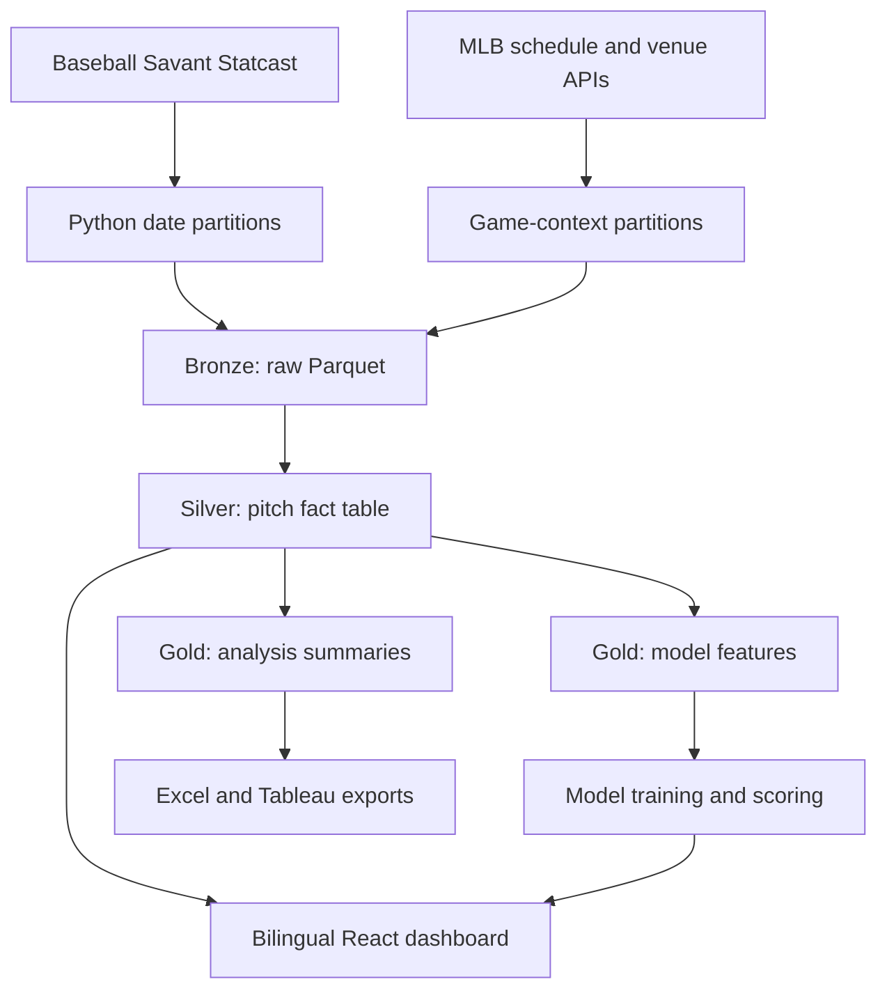
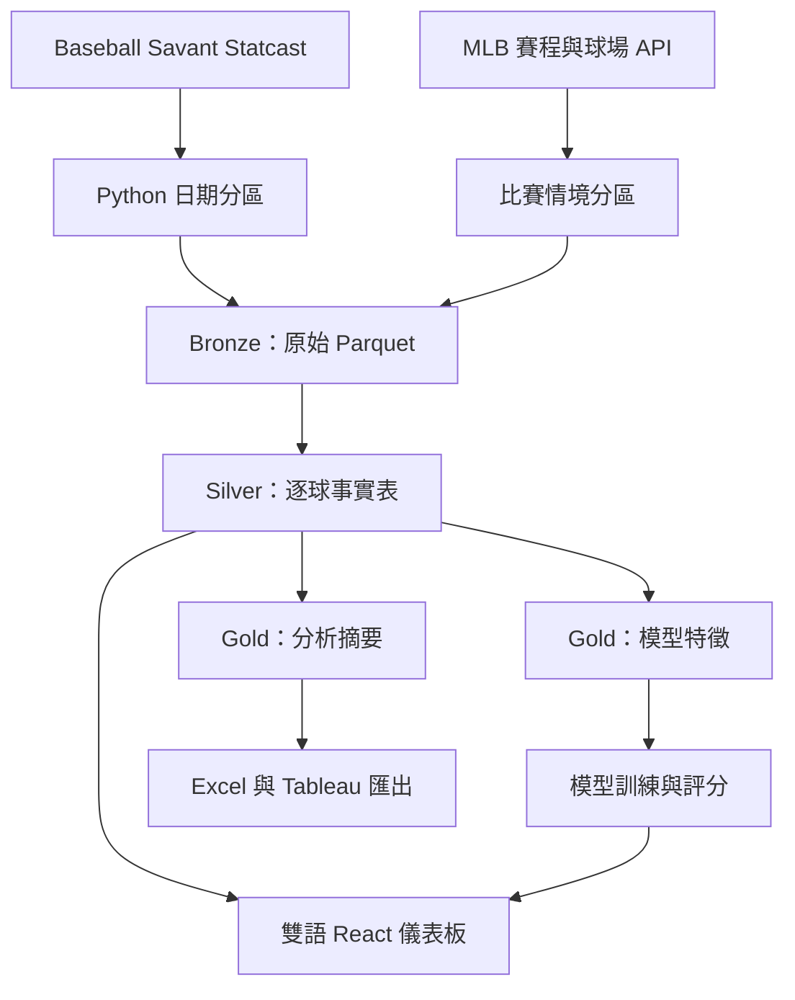

# MLB Pitch Strategy & Plate Discipline Analytics

[English](#english) · [繁體中文](#繁體中文)

> A reproducible MLB Statcast analytics portfolio: Python + DuckDB + SQL + scikit-learn + React.
>
> 可重現的 MLB Statcast 分析作品集：Python + DuckDB + SQL + scikit-learn + React。

---

## English

### Overview

This project examines how MLB pitchers change pitch selection, location, and outcomes across count states and batter handedness. It provides descriptive analysis, post-release pitch-quality models, fantasy-pitching research tools, and a bilingual interactive dashboard.

It is **not** a game-winner prediction system, betting model, or guaranteed fantasy recommendation.

### Highlights

- Restartable Statcast extraction through `pybaseball`
- MLB schedule, venue, roof, and recorded-weather context
- Date-partitioned Parquet files and DuckDB bronze/silver/gold layers
- SQL joins, CTEs, window functions, conditional aggregation, and quality gates
- Leakage-controlled, out-of-time whiff and hard-hit probability models
- Fantasy Pitching Radar and seven-day Stream Planner
- Tableau-ready CSV exports and an Excel lesson workbook
- Reproducible Jupyter tutorials and model audits
- Self-contained React dashboard with English / Traditional Chinese UI
- Source lineage, definitions, denominators, and sample limits shown in the dashboard

### Architecture



The pitch fact table has one row per pitch, keyed by `game_pk + at_bat_number + pitch_number`.

### Quick start

Requirements: Python 3.11+ and Node.js/npm.

```powershell
# 1. Create the Python environment
python -m venv .venv
.\.venv\Scripts\Activate.ps1
python -m pip install -r requirements.txt

# 2. Run the small real-data pipeline (April 1–3, 2025)
python run_pipeline.py --mode sample

# 3. Build the dashboard
Set-Location dashboard
npm.cmd install
npm.cmd run build
```

Open `dashboard/dist/index.html` after the build completes. On macOS/Linux, activate the environment with `source .venv/bin/activate` and use `npm` in place of `npm.cmd`.

The extractor validates existing Parquet partitions before reusing them. Sample mode reads only its configured dates, so a prior full-season run cannot silently alter the lesson dataset.

### Full pipeline

```powershell
python run_pipeline.py --mode full
Set-Location dashboard
npm.cmd run build
```

Full mode processes the configured 2025 regular season and the 2026 season through the latest complete day. It refreshes recent partitions, rebuilds DuckDB and exports, retrains the two models, scores the chronological holdout, and refreshes the fantasy tools and dashboard snapshot.

The complete run is substantially slower and downloads much more data than sample mode.

### Models and interpretation

The whiff model estimates `P(whiff | swing)` after a pitch has been tracked. The hard-hit model estimates hard-hit probability for eligible batted balls. They may use velocity, movement, release, and location from the current pitch, so neither model is a pre-pitch forecast.

Training and evaluation are time ordered: the earlier season is used for training, followed by chronological validation and untouched test periods. Rolling player form, pitch-type history, and matchup history use prior events only and are frozen before each game.

Generated model artifacts are written under `outputs/models/` and `outputs/predictions/`. These folders are intentionally excluded from Git; regenerate them locally to obtain current results.

### Fantasy research tools

The dashboard includes:

- **Fantasy Pitching Radar:** 7-, 14-, and 30-day windows with Roto balance, strikeout-upside, and ratio-protection profiles.
- **Upcoming Stream Planner:** confirmed probable starters combined with pitcher skill, opponent tendencies, park context, and a separate weather-risk flag.
- **League Strategy Lab:** a transparent personalized-fit calculation for category or points-style research.
- **Player Pool Manager:** browser-local labels such as Available, My roster, Watchlist, and Unavailable.

These tools do not know roster availability or every league's scoring rules. They support research; they do not promise fantasy outcomes.

### Daily update on Windows

Install the optional Windows Task Scheduler job:

```powershell
powershell.exe -NoProfile -ExecutionPolicy Bypass -File .\scripts\install_daily_update_task.ps1
```

Run the same workflow manually:

```powershell
powershell.exe -NoProfile -ExecutionPolicy Bypass -File .\scripts\run_daily_update.ps1
```

The task is named `MLB-Pitch-Analytics-Daily-Update` and is configured for 06:30 local time. Local status and transcript files are written under `logs/`, which is excluded from Git.

### Validation

```powershell
# Python tests
.\.venv\Scripts\python.exe -m unittest discover -s tests -p "test_*.py" -v

# Dashboard integrity and production build
Set-Location dashboard
npm.cmd run verify:runtime
npm.cmd run build
```

### Project structure

```text
config/                Pipeline dates, modes, and local paths
data/                  Generated raw/context/Tableau data (Git-ignored)
database/              Generated DuckDB database (Git-ignored)
dashboard/             React source, reviewed snapshot, and build tooling
notebooks/             Tutorial and model-evaluation notebooks
outputs/               Generated models, predictions, reports, and workbook
scripts/               Dashboard build, sanitization, and Windows automation
sql/                   Silver, gold, and analysis SQL
src/                   Extraction, transformation, validation, and export code
tests/                 Python unit and data-quality tests
```

### Metric definitions

- `Whiff Rate = whiffs / swings`
- `Chase Rate = out-of-zone swings / out-of-zone pitches`
- `Hard-Hit Rate = batted balls at 95+ mph / batted-ball events`
- `Zone Rate = pitches in Statcast zones 1–9 / all pitches`

Always inspect the denominator and sample threshold before comparing pitchers.

### Data and security

No API key is required for the documented pipeline. Do not commit `.env` files, credentials, raw data, generated databases, model artifacts, exports, logs, or browser profiles. See [SECURITY.md](SECURITY.md) for the publication checklist.

Primary sources:

- [Baseball Savant CSV documentation](https://baseballsavant.mlb.com/csv-docs)
- [Baseball Savant Statcast search](https://baseballsavant.mlb.com/statcast_search)
- [MLB Stats API schedule](https://statsapi.mlb.com/api/v1/schedule)
- [MLB Stats API venues](https://statsapi.mlb.com/api/v1/venues)
- [pybaseball Statcast documentation](https://github.com/jldbc/pybaseball/blob/master/docs/statcast.md)

---

## 繁體中文

### 專案簡介

本專案分析 MLB 投手在不同球數狀態與打者慣用手下，如何改變球種選擇、進壘位置與結果。內容涵蓋描述性分析、出手後球質模型、Fantasy 投手研究工具，以及可切換英文／繁體中文的互動式儀表板。

本專案**不是**比賽勝負預測、運彩模型，也不保證 Fantasy 決策結果。

### 專案亮點

- 透過 `pybaseball` 取得可中斷續跑的 Statcast 資料
- 整合 MLB 賽程、球場、屋頂狀態與紀錄天氣
- 使用日期分區 Parquet 與 DuckDB bronze／silver／gold 資料層
- 展示 SQL JOIN、CTE、視窗函數、條件彙總與資料品質閘門
- 避免資料洩漏的跨時間揮空率與強擊球機率模型
- Fantasy Pitching Radar 與未來七天 Stream Planner
- Tableau 用 CSV 匯出與 Excel 教學活頁簿
- 可重現的 Jupyter 教學與模型稽核 Notebook
- 英文／繁體中文 React 儀表板，並可產生單一 HTML 檔案
- 儀表板中公開資料來源、指標定義、分母與樣本限制

### 系統架構



逐球事實表每一列代表一球，主鍵為 `game_pk + at_bat_number + pitch_number`。

### 快速開始

需求：Python 3.11+ 與 Node.js/npm。

```powershell
# 1. 建立 Python 環境
python -m venv .venv
.\.venv\Scripts\Activate.ps1
python -m pip install -r requirements.txt

# 2. 執行小型真實資料流程（2025 年 4 月 1–3 日）
python run_pipeline.py --mode sample

# 3. 建置儀表板
Set-Location dashboard
npm.cmd install
npm.cmd run build
```

建置完成後開啟 `dashboard/dist/index.html`。macOS/Linux 請以 `source .venv/bin/activate` 啟用環境，並以 `npm` 取代 `npm.cmd`。

擷取程式會先驗證既有 Parquet 分區再重複使用。Sample 模式只讀取設定中的日期，因此先前的完整球季資料不會悄悄改變教學樣本。

### 完整資料流程

```powershell
python run_pipeline.py --mode full
Set-Location dashboard
npm.cmd run build
```

Full 模式會處理設定中的 2025 年例行賽，以及 2026 年截至最近完整日期的資料；同時重新整理近期分區、DuckDB、匯出檔、兩個模型、時間序列測試集評分、Fantasy 工具與儀表板快照。

完整模式下載量與執行時間都遠高於 Sample 模式。

### 模型與解讀方式

揮空模型估計球被追蹤後的 `P(whiff | swing)`；強擊球模型則估計合格擊球事件成為強擊球的機率。模型可能使用該球的球速、位移、出手特徵與進壘位置，因此不能描述為投球前預測。

訓練與評估依時間排序：較早球季作為訓練資料，之後依序切分驗證集與未接觸測試集。球員近期狀態、球種歷史與對戰歷史只使用過去事件，並在每場比賽開始前凍結。

模型產物會寫入 `outputs/models/` 與 `outputs/predictions/`。這些資料夾刻意不提交到 Git；若要取得最新結果，請在本機重新產生。

### Fantasy 研究工具

儀表板包含：

- **Fantasy Pitching Radar：**提供 7、14、30 天視窗，以及 Roto 平衡、三振上限與比率保護模式。
- **Upcoming Stream Planner：**只採用已確認的預定先發，結合投手能力、對手趨勢、球場環境，並另外標示天氣風險。
- **League Strategy Lab：**針對 Categories 或 Points 類型聯盟提供透明的個人化適配分數。
- **Player Pool Manager：**可在瀏覽器本機標記 Available、My roster、Watchlist、Unavailable。

這些工具不知道即時自由球員狀態，也無法涵蓋每個聯盟的計分規則；用途是協助研究，而不是保證結果。

### Windows 每日更新

安裝選用的 Windows 工作排程：

```powershell
powershell.exe -NoProfile -ExecutionPolicy Bypass -File .\scripts\install_daily_update_task.ps1
```

手動執行相同流程：

```powershell
powershell.exe -NoProfile -ExecutionPolicy Bypass -File .\scripts\run_daily_update.ps1
```

排程名稱為 `MLB-Pitch-Analytics-Daily-Update`，預設每天本機時間 06:30 執行。狀態與逐日紀錄會寫入已被 Git 排除的 `logs/`。

### 驗證方式

```powershell
# Python 測試
.\.venv\Scripts\python.exe -m unittest discover -s tests -p "test_*.py" -v

# 儀表板完整性檢查與正式建置
Set-Location dashboard
npm.cmd run verify:runtime
npm.cmd run build
```

### 專案結構

```text
config/                資料日期、模式與本機路徑設定
data/                  產生的原始／情境／Tableau 資料（Git 排除）
database/              產生的 DuckDB 資料庫（Git 排除）
dashboard/             React 原始碼、審查快照與建置工具
notebooks/             教學與模型評估 Notebook
outputs/               產生的模型、預測、報告與 Excel 活頁簿
scripts/               儀表板建置、清理與 Windows 自動化
sql/                   Silver、Gold 與分析 SQL
src/                   擷取、轉換、驗證與匯出程式
tests/                 Python 單元測試與資料品質測試
```

### 指標定義

- `揮空率 = 揮空次數 / 揮棒次數`
- `追打率 = 好球帶外揮棒 / 好球帶外投球`
- `強擊球率 = 初速至少 95 mph 的擊球 / 有效擊球事件`
- `進壘率 = Statcast 1–9 區投球 / 所有投球`

比較投手前，務必檢查指標分母與最低樣本門檻。

### 資料與安全

文件中的流程不需要 API Key。請勿提交 `.env`、帳密、原始資料、資料庫、模型產物、匯出檔、日誌或瀏覽器設定檔。完整公開檢查清單請參閱 [SECURITY.md](SECURITY.md)。

主要資料來源：

- [Baseball Savant CSV 文件](https://baseballsavant.mlb.com/csv-docs)
- [Baseball Savant Statcast Search](https://baseballsavant.mlb.com/statcast_search)
- [MLB Stats API 賽程](https://statsapi.mlb.com/api/v1/schedule)
- [MLB Stats API 球場](https://statsapi.mlb.com/api/v1/venues)
- [pybaseball Statcast 文件](https://github.com/jldbc/pybaseball/blob/master/docs/statcast.md)

---

## License / 授權

No license has been added. All rights are reserved unless the repository owner states otherwise.

目前尚未加入授權條款；除非專案擁有者另行說明，否則保留所有權利。
