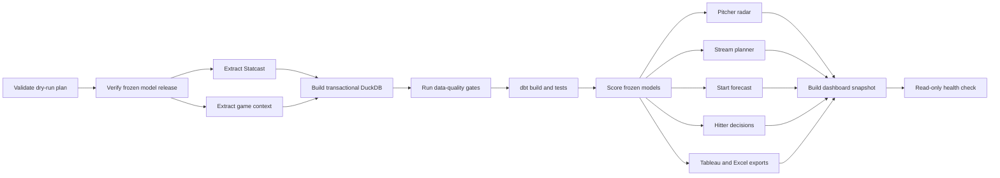

# Airflow orchestration / Airflow 工作流程編排

The Airflow 3 DAG turns the existing daily CLI sequence into an inspectable, scheduled graph without creating a second set of business logic. `run_pipeline.py` and Airflow share the same canonical command builder, so CLI changes cannot silently drift from the orchestrated commands.

Airflow 3 DAG 將既有 daily CLI 流程轉成可檢查、可排程的 graph，且不複製另一套商業邏輯。`run_pipeline.py` 與 Airflow 共用同一個 canonical command builder，因此 CLI 變更不會悄悄與 orchestration commands 分歧。

## DAG design / DAG 設計



- Schedule: 06:30 `America/Los_Angeles`, with daylight-saving handling.
- `catchup=False`: enabling the DAG never launches an accidental historical backfill.
- `max_active_runs=1`: two refreshes cannot overlap and compete for the same DuckDB/output paths.
- `max_active_tasks=4`: independent extraction and product branches demonstrate bounded parallel execution.
- Every task has an execution timeout; transient extraction tasks retry twice with a ten-minute delay.
- Database build, quality validation and dbt form a serial barrier before read-heavy parallel tasks.
- The final health check fails the DAG when freshness or lineage evidence is not usable.

- 排程：依 `America/Los_Angeles` 時區每天 06:30 執行，包含日光節約時間處理。
- `catchup=False`：啟用 DAG 時不會意外回補全部歷史日期。
- `max_active_runs=1`：兩次 refresh 不會重疊並競爭同一個 DuckDB／output paths。
- `max_active_tasks=4`：獨立 extraction 與 product branches 展示有上限的平行執行。
- 每個 task 都有 execution timeout；暫時性 extraction 失敗最多重試兩次，每次間隔十分鐘。
- Database build、quality validation 與 dbt 形成 serial barrier，完成後才執行大量讀取的平行 tasks。
- 最終 health check 在 freshness 或 lineage 證據不可用時使 DAG 失敗。

## Local Docker environment / 本機 Docker 環境

The included Compose stack is a **local portfolio environment**, not a production Airflow deployment. It uses Airflow 3.3.1, LocalExecutor, a dedicated PostgreSQL metadata database, an API server, scheduler and the required standalone DAG processor. The API binds only to `127.0.0.1:8080`.

內附 Compose stack 是**本機作品集環境**，不是 production Airflow deployment。它使用 Airflow 3.3.1、LocalExecutor、獨立 PostgreSQL metadata database、API server、scheduler，以及 Airflow 3 必要的獨立 DAG processor；API 只綁定 `127.0.0.1:8080`。

From the repository root in PowerShell:

```powershell
Copy-Item .env.example .env
# Replace both AIRFLOW_* placeholder secrets in .env before starting.

docker compose --env-file .env -f orchestration/compose.yaml build
docker compose --env-file .env -f orchestration/compose.yaml up airflow-init
docker compose --env-file .env -f orchestration/compose.yaml up -d
docker compose --env-file .env -f orchestration/compose.yaml ps
```

Open `http://127.0.0.1:8080`, unpause `mlb_pitch_analytics_daily`, and trigger it manually only after one successful full retraining workflow has created a verified model release:

開啟 `http://127.0.0.1:8080`，找到並解除暫停 `mlb_pitch_analytics_daily`。必須先成功執行一次 full retraining workflow、建立已驗證 model release，之後才能手動觸發 daily DAG：

```powershell
.\.venv\Scripts\python.exe run_pipeline.py --mode full --workflow retrain
```

Stop services without deleting metadata history:

```powershell
docker compose --env-file .env -f orchestration/compose.yaml down
```

Adding `--volumes` deletes the Airflow metadata and logs and should be used only for an intentional local reset.

加入 `--volumes` 會刪除 Airflow metadata 與 logs，只能用於明確的本機重設。

## Safe validation / 安全驗證

CI installs Airflow using the official Python 3.12 constraints, imports the real DAG, asserts all 15 tasks and dependency edges, checks concurrency/timeouts, initializes isolated SQLite metadata, and executes `dag.test()` with `MLB_AIRFLOW_EXECUTION_MODE=plan`. Plan mode traverses the complete DAG but does not launch extraction, database, dbt, model or dashboard commands.

CI 依官方 Python 3.12 constraints 安裝 Airflow，匯入真實 DAG、驗證全部 15 個 tasks 與 dependency edges、檢查 concurrency／timeouts、初始化隔離的 SQLite metadata，並以 `MLB_AIRFLOW_EXECUTION_MODE=plan` 執行 `dag.test()`。Plan mode 會走完 DAG，但不會啟動 extraction、database、dbt、model 或 dashboard commands。

The repository-level no-write preview remains the fastest first check:

```powershell
.\.venv\Scripts\python.exe run_pipeline.py --mode full --workflow daily --dry-run
```

A successful dry run proves command planning only. It does not prove that Airflow services started, data refreshed, or the scheduled DAG completed.

成功的 dry run只證明 command planning；它不代表 Airflow services 已啟動、資料已更新，或 scheduled DAG 已完成。

## Observability and failure behavior / 可觀測性與失敗行為

Each task logs its exact command and returns a compact receipt containing start/end timestamps, duration, working directory, execution mode and status. Airflow owns retries and task/DAG state; project outputs retain their existing lineage and health evidence. A failed task blocks every dependent task, while unrelated parallel branches remain independently visible in the graph and logs.

每個 task 都會記錄實際 command，並回傳包含開始／結束時間、duration、working directory、execution mode 與 status 的精簡 receipt。Airflow 負責 retries 與 task／DAG state；專案 outputs 繼續保存既有 lineage 與 health evidence。任一 task 失敗會阻擋其 downstream tasks，其他平行 branches 則可在 graph 與 logs 中獨立檢查。

The local stack deliberately uses Simple Auth Manager with all-admin access because it is bound to localhost for development. Never expose it publicly. A production deployment needs TLS, a production auth manager, a secret backend, remote object storage for logs/artifacts and a managed/distributed executor.

本機 stack 因為只綁定 localhost，刻意使用開發用途的 Simple Auth Manager all-admin 模式；絕不可公開暴露。Production deployment 需另行配置 TLS、production auth manager、secret backend、遠端 log／artifact object storage 與 managed／distributed executor。
